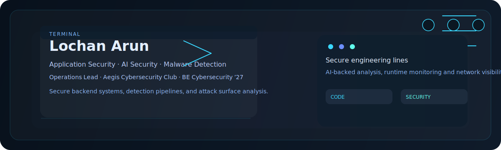
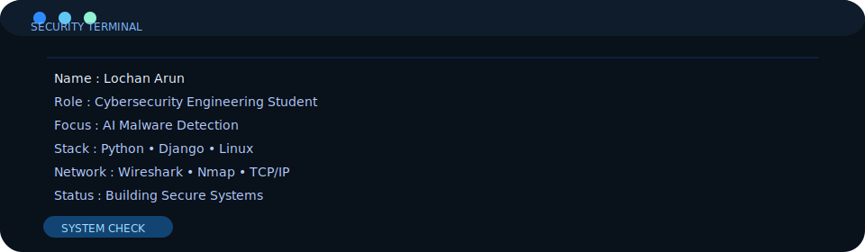
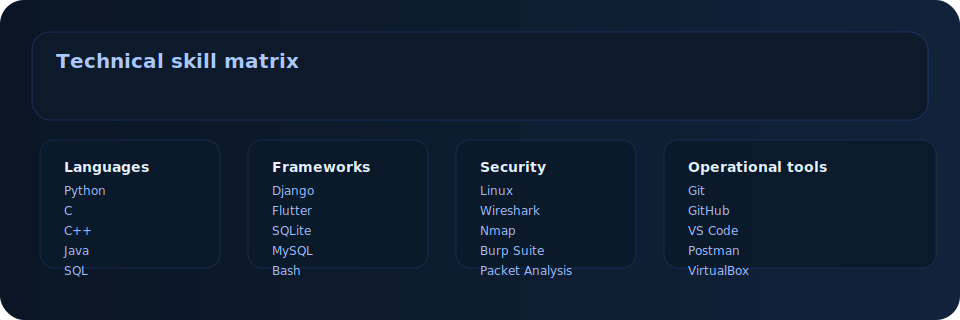
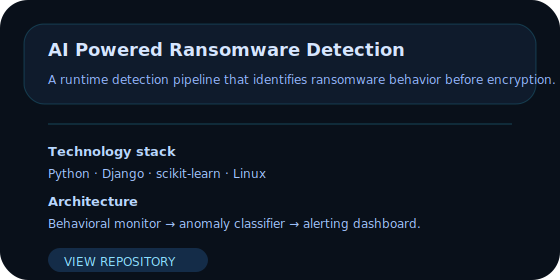
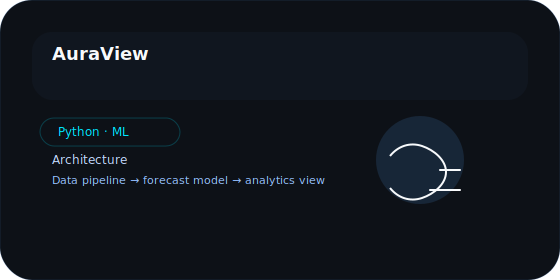
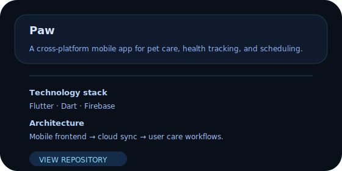

## Security portfolio

Lochan Arun builds practical security systems by combining software engineering, network visibility, and cybersecurity analysis. He focuses on secure backend architecture, runtime threat detection, and application-level resilience.

As Operations Lead at Aegis Cybersecurity Club and a BE Computer Science graduate in Cybersecurity (2027), he evaluates real attack behavior, designs defenses, and supports team operations with a security-first mindset.

---

## Current focus

- AI Powered Ransomware Detection
- Application Security
- Python Development
- Django
- Linux
- Network Security
- Threat Detection
- Cisco Networking
- Malware Analysis
- Secure Backend Development

---

## Technical skills

| Category | Core expertise |
|---|---|
| Programming | Python · C · C++ · Java · SQL · Bash |
| Frameworks | Django · Flutter |
| Databases | SQLite · MySQL |
| Cybersecurity | Linux · Wireshark · Nmap · Burp Suite · Cisco Packet Tracer |
| Networking | OWASP Top 10 · TCP/IP · OSI Model · Network Analysis · Packet Analysis |
| Security operations | Threat Detection · Malware Analysis · Reverse Engineering · Secure Coding |
| Tools | Git · GitHub · VS Code · Postman · VirtualBox |

---

## Featured projects

**AI Powered Ransomware Detection** — A detection pipeline built to identify ransomware behavior before file encryption completes. The system combines process monitoring, anomaly scoring, and alert orchestration.

**AuraView** — Environmental analytics and forecast visualization for air quality. It transforms historical data into actionable insight through a lightweight prediction interface.

**Paw** — A cross-platform mobile application for pet care, health tracking, and scheduling.

---

## Certifications

- Google Cybersecurity Professional Certificate

---

## Research interests

- Application Security
- AI Security
- Malware Analysis
- Threat Hunting
- Cloud Security
- Network Security
- DevSecOps
- Threat Intelligence
- Reverse Engineering

---

## GitHub analytics

---

## Connect

- GitHub: https://github.com/lochanshetty
- LinkedIn: https://linkedin.com/in/your-linkedin
- Email: mailto:your.email@example.com
- Portfolio: https://your-portfolio.example.com

