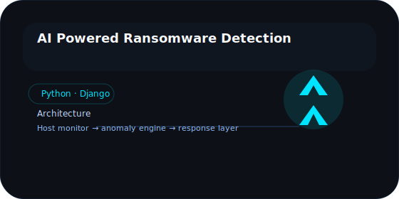

## Cybersecurity engineer · AI security · application security · malware detection

Lochan Arun solves real-world cybersecurity problems with software engineering, secure networking, and security research. His portfolio is built around systems that withstand attacks, detect threats, and keep production systems trusted.

## Current focus

- AI Powered Ransomware Detection
- Application Security
- Python
- Django
- Linux
- Network Security
- Threat Detection
- Malware Analysis
- Secure Backend Development

## Featured projects

<table>
  <tr>
    <td></td>
    <td></td>
    <td></td>
  </tr>
</table>

### AI Powered Ransomware Detection

A modern defense pipeline that detects operational ransomware behavior before encryption completes. It combines process profiling, anomaly scores, and alert workflows to protect critical infrastructure.

- Architecture: host monitor → classifier → response engine
- Stack: Python · Django · Linux · Machine learning
- Repository: https://github.com/lochanshetty/ransomware-detection

### AuraView

An analytics tool for air quality and environmental data that turns raw measurements into visual insight and predictive summaries.

- Architecture: data ingestion → prediction model → dashboard interface
- Stack: Python · ML · visualization
- Repository: https://github.com/lochanshetty/auraview

### Paw

A polished cross-platform mobile system for pet care management, scheduling, and health tracking.

- Architecture: mobile UI → cloud sync → notification engine
- Stack: Flutter · Dart · Firebase
- Repository: https://github.com/lochanshetty/paw

## Research interests

- Application Security
- AI Security
- Malware Analysis
- Threat Hunting
- Cloud Security
- Network Security
- DevSecOps
- Threat Intelligence
- Reverse Engineering

## Certifications

- Google Cybersecurity Professional Certificate

## GitHub analytics

## Contact

- GitHub: https://github.com/lochanshetty
- LinkedIn: https://linkedin.com/in/your-linkedin
- Email: mailto:your.email@example.com
- Portfolio: https://your-portfolio.example.com

